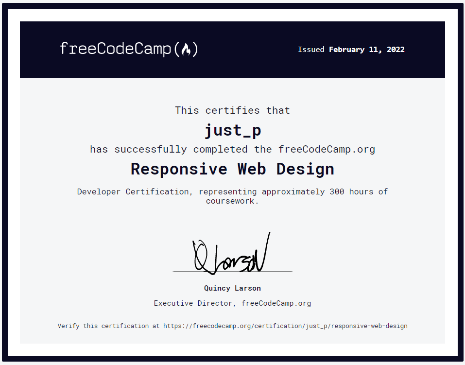
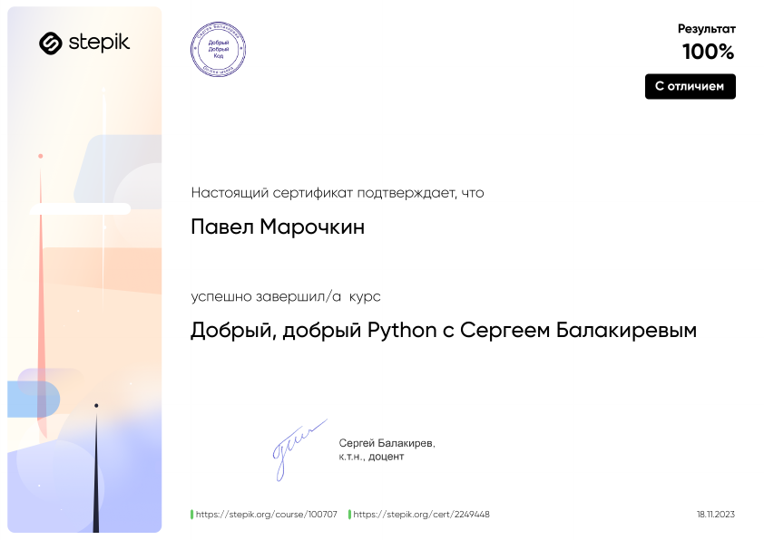

# Привет 👋, Зови меня П.
### 💻 Я web-разработчик

## ✏️ О себе
Серьёзно начал изучать программирование (в разных направлениях) с 2022 и с тех пор иду к своей цели, не взирая на трудности! Не боюсь сложных задач, люблю узнавать что-нибудь новое! Весёлый, позитивный молодой человек. Всегда рад новым предложениям.

## 📜 Сведения
- 📆 Возраст: 23
- 💼 Образование: Высшее (ИЭФ "Синергия" -- Информационные системы и технологии)
- 🌍 Место жительства: Россия, г. Брянск

## 🧰 Навыки 
- JS
- HTML
- CSS (в том числе: flex, grid, адаптивная вёрстка, bootstrap5)
- Python
- Django

## 🖥️ Пройденныые курсы

### Курс по web-дизайну

### Курс по Python

[Ссылка на репозиторий](selfedu_dobriy_python_learning)

### Курс по Python ООП

[Ссылка на репозиторий](https://github.com/justP-official/selfedu_oop_learning)

### Контакты

        

  

<!--
**justP-official/justP-official** is a ✨ _special_ ✨ repository because its `README.md` (this file) appears on your GitHub profile.

Here are some ideas to get you started:

- 🔭 I’m currently working on ...
- 🌱 I’m currently learning ...
- 👯 I’m looking to collaborate on ...
- 🤔 I’m looking for help with ...
- 💬 Ask me about ...
- 📫 How to reach me: ...
- 😄 Pronouns: ...
- ⚡ Fun fact: ...
-->
