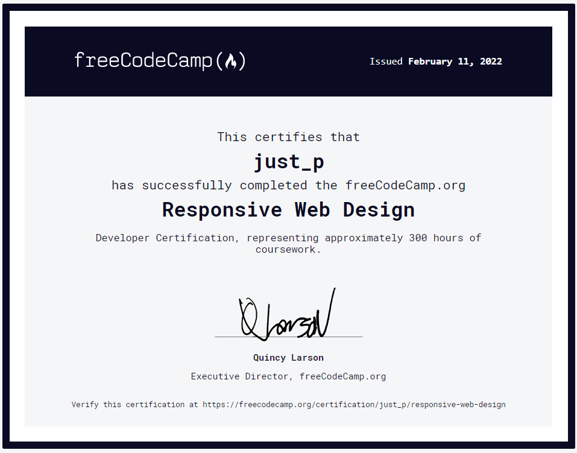
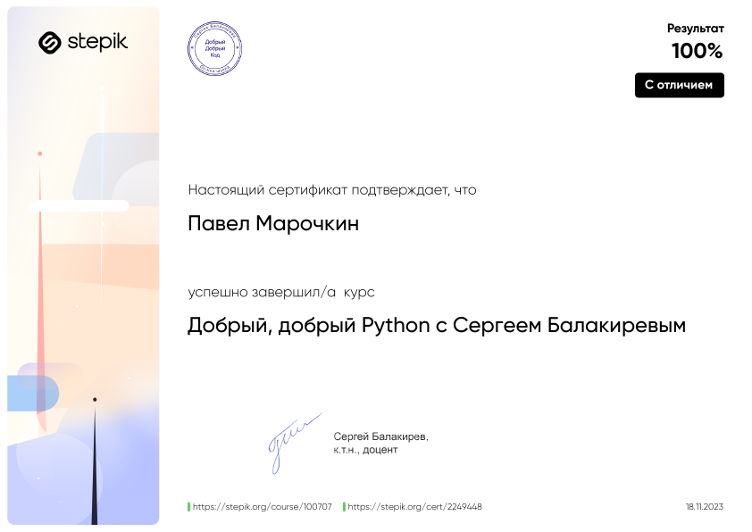
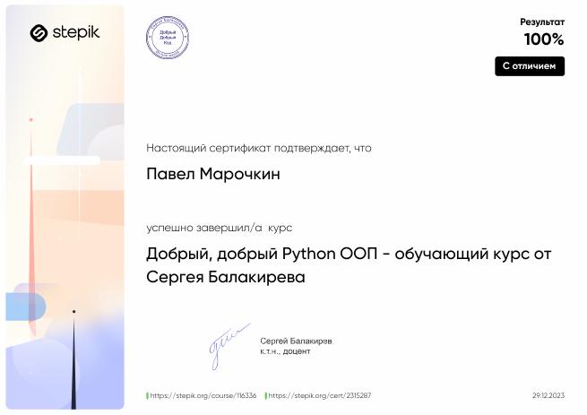
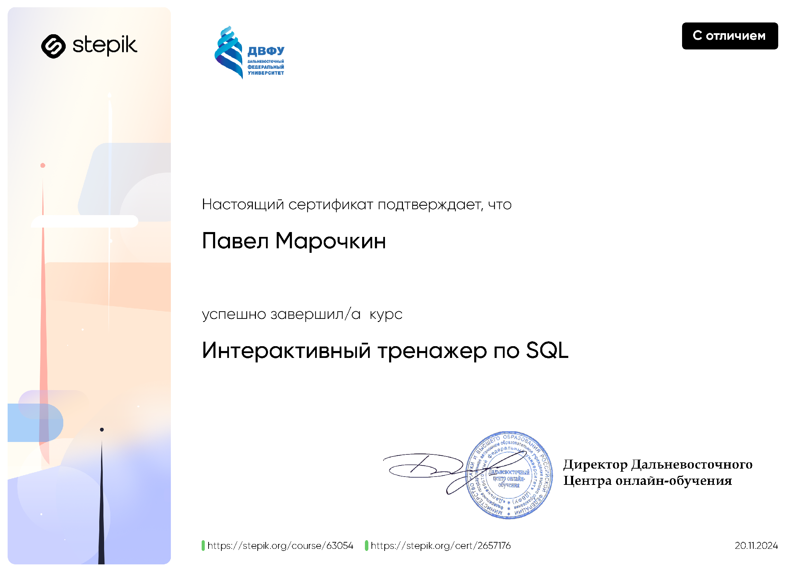

# Привет 👋, Зови меня П.
**💻 Я web-разработчик**

## ✏️ О себе
Web-developer, опыт работы более 3 лет. Не боюсь сложных задач, люблю узнавать что-нибудь новое! Весёлый, позитивный молодой человек. Всегда рад новым предложениям.

## 📜 Сведения
- 📆 Дата рождения: 12 Июля 2000
- 💼 Образование: Высшее (ИЭФ "Синергия" -- Информационные системы и технологии)
- 🌍 Место жительства: Россия, г. Брянск

## 🧰 Навыки

### Backend
- Python
- Django
- FastAPI
- Pydantic
- Celery
- Aiogram
- SqlAlchemy
- Alembic

### Frontend
- JS
- HTML
- CSS

### Infrastructure
- SQL (PostgreSQL)
- Redis
- Docker
- Docker Compose

## 🖥️ Пройденныые курсы

### Курс по web-дизайну

### Курс по Python

[Ссылка на репозиторий](selfedu_dobriy_python_learning)

### Курс по Python ООП

[Ссылка на репозиторий](https://github.com/justP-official/selfedu_oop_learning)

### Курс по SQL

### Контакты

        
